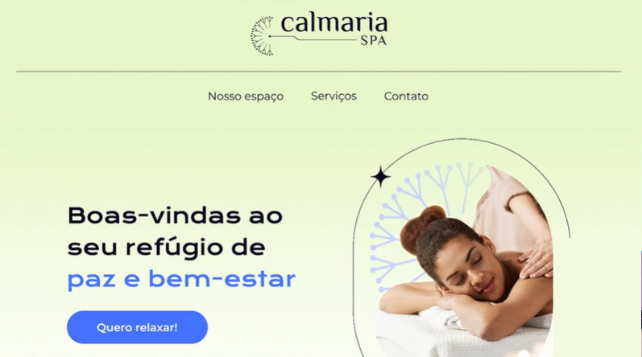

# [CalmariaSPA](https://larisnarciso.github.io/Alura/Front-End/CSS/CalmariaSPA/index.html)



Projeto desenvolvido no curso de [CSS: construindo layouts com Grid](https://cursos.alura.com.br/course/sass-css-estilizando-site).

Para visualizar o projeto, click no link: [CalmariaSPA](https://larisnarciso.github.io/Alura/Front-End/CSS/CalmariaSPA/index.html)

## Descrição

O projeto CalmariaSPA é uma página desenvolvida utilizando o SASS, um pré-processador de CSS. O SASS proporciona recursos adicionais ao CSS, facilitando a reutilização e aplicação de estilos de forma mais eficiente.

## Instruções:

1. Clone o repositório.

```
https://github.com/larisnarciso/Alura.git
```

2. Dentro da pasta /Front-End/CSS/CalmariaSPA abra o arquivo `index.html` no navegador.

## Tecnologias:


