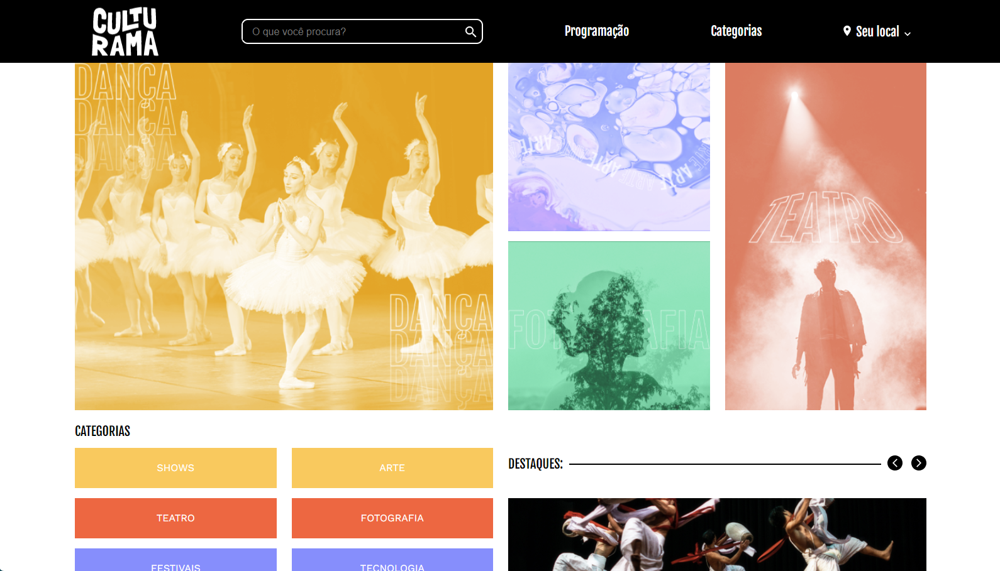

# [Culturama](https://larisnarciso.github.io/Alura/Front-End/CSS/Culturama/index.html)



Projeto desenvolvido no curso de [Praticando CSS: Grid e Flexbox](https://cursos.alura.com.br/course/praticando-css-grid-flexbox).

Para visualizar o projeto, click no link: [Culturama](https://larisnarciso.github.io/Alura/Front-End/CSS/Culturama/index.html)

## Descrição

O projeto Culturama é uma página destinada à divulgação de eventos culturais, contendo três telas principais: mobile, com largura de 360 pixels; tablets, com largura de 720 pixels; e desktops, com largura de 1440 pixels. Elementos desse projeto incluem o cabeçalho, a seção de banner, categorias, destaques, "próximos eventos", "adicione à sua agenda" e o rodapé.

Este projeto tem como foco a prática de Flexbox e Grid para o posicionamento dos elementos na página.

## Instruções:

1. Clone o repositório.

```
https://github.com/larisnarciso/Alura.git
```

2. Dentro da pasta /Front-End/CSS/Culturama abra o arquivo `index.html` no navegador.

## Tecnologias:


