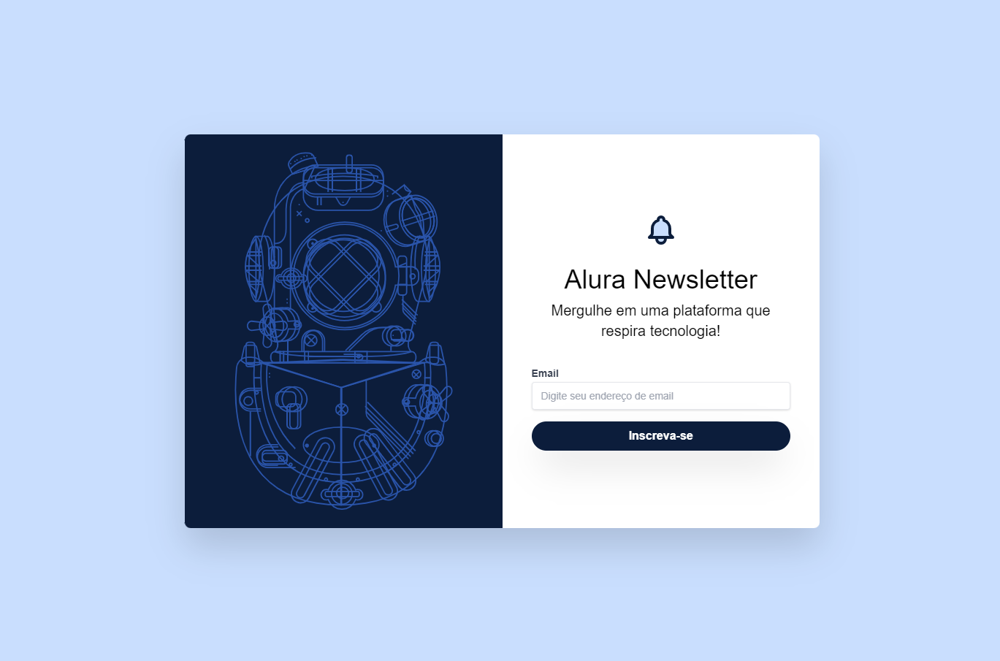

# [Newsletter](https://larisnarciso.github.io/Alura/Front-End/CSS/Newsletter/index.html)



Projeto desenvolvido no curso de [Tailwind CSS: estilizando a sua página com classes utilitárias](https://cursos.alura.com.br/course/tailwind-css-estilizando-pagina-classes-utilitarias).

Para visualizar o projeto, click no link: [Newsletter](https://larisnarciso.github.io/Alura/Front-End/CSS/Newsletter/index.html)

## Descrição

O projeto Newsletter é uma página desenvolvida utilizando o Framework .

## Instruções:

1. Clone o repositório.

```
https://github.com/larisnarciso/Alura.git
```

2. Dentro da pasta /Front-End/CSS/Newsletter abra o arquivo `index.html` no navegador.

## Tecnologias:


