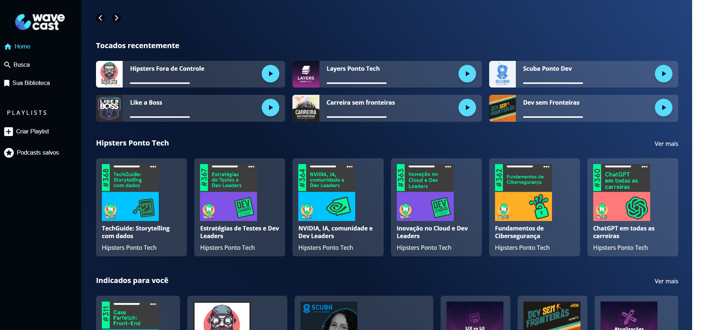

# [WaveCast](https://larisnarciso.github.io/Alura/Front-End/CSS/WaveCast/index.html))



Projeto desenvolvido no curso de [CSS: construindo layouts com Grid](https://cursos.alura.com.br/course/css-construindo-layouts-com-grid).

Para visualizar o projeto, click no link: [WaveCast](https://larisnarciso.github.io/Alura/Front-End/CSS/WaveCast/index.html)

## Descrição

O projeto WaveCast é uma página responsiva dedicada a podcasts. A essência do projeto reside na prática do CSS Grid para posicionar elementos dinamicamente, proporcionando uma experiência de usuário fluida e adaptável.

- Aplicação prática do CSS Grid para criar layouts responsivos.
- Utilização de conceitos como minmax e auto-fit para ajustar elementos conforme a largura do layout.
- Implementação de media queries para otimizar a experiência em diferentes dispositivos.
- Organização eficiente de pastas e arquivos CSS.
- Discernimento entre os cenários ideais para aplicar display: grid e display: flex, garantindo flexibilidade no design.
- Exploração de diferentes abordagens para posicionar elementos na página, proporcionando uma compreensão abrangente do design responsivo.

## Instruções:

1. Clone o repositório.

```
https://github.com/larisnarciso/Alura.git
```

2. Dentro da pasta /Front-End/CSS/WaveCast abra o arquivo `index.html` no navegador.

## Tecnologias:


