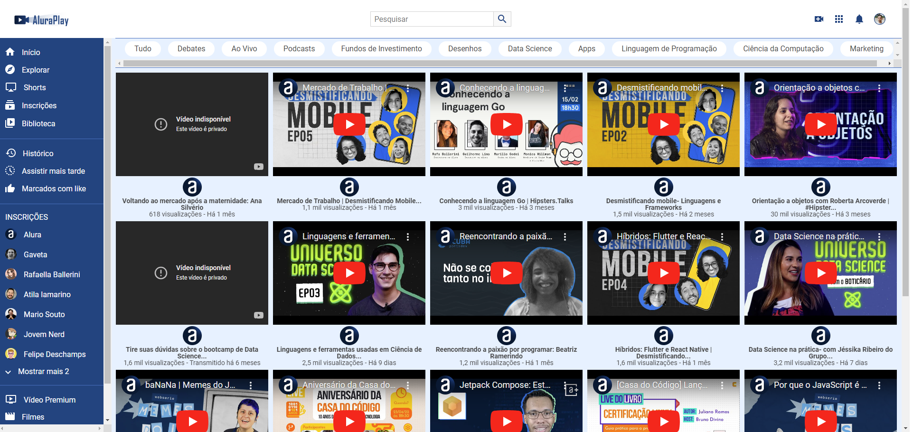

# [AluraPlay](https://larisnarciso.github.io/Alura/Front-End/HTML-CSS/AluraPlay/index.html))



Projeto desenvolvido no curso de [CSS: Flexbox e layouts responsivos](https://cursos.alura.com.br/course/css-flexbox-layouts-responsivos).

Para visualizar o projeto, click no link: [AluraPlay](https://larisnarciso.github.io/Alura/Front-End/HTML-CSS/AluraPlay/index.html)

## Descrição

O AluraPlay é uma plataforma de compartilhamento de vídeos que inclui elementos como um cabeçalho, uma barra de pesquisa e um botão para a inserção de novos vídeos. Neste projeto, foram aplicados conceitos de Flexbox para organizar e melhorar a disposição dos elementos na página. Utilizando HTML e CSS, foi feita a reestruturação do layout do Alura Play, aproveitando as propriedades do Flexbox para criar uma interface mais flexível e responsiva. Essa abordagem permitiu uma organização mais eficiente dos componentes, garantindo uma experiência de usuário mais agradável e adaptável a diferentes dispositivos.

## Instruções:

1. Clone o repositório.

```
https://github.com/larisnarciso/Alura.git
```

2. Dentro da pasta /Front-End/HTML-CSS/AluraPlay abra o arquivo `index.html` no navegador.

## Tecnologias:


