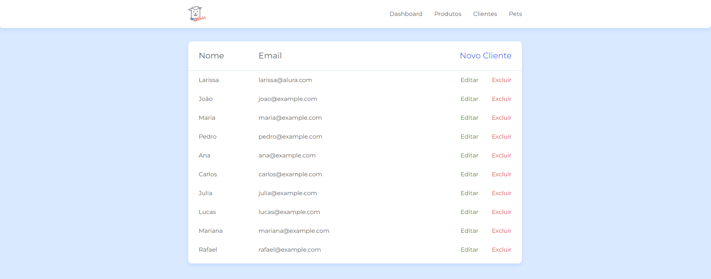

# [CRUD - Doguito](https://larisnarciso.github.io/Alura/Front-End/JavaScript/CrudDoguito/src/telas/lista_cliente.html)



Projeto desenvolvido no curso de [JS na web: CRUD com JavaScript assíncrono](https://cursos.alura.com.br/course/javascript-crud-assincrono).

Para visualizar o projeto, click no link: [Doguito](https://larisnarciso.github.io/Alura/Front-End/JavaScript/CrudDoguito/src/telas/lista_cliente.html)

## Descrição

O Doguito é um projeto CRUD(*C*reate-*R*ead-*U*pdate-*D*elete) realizado em JavaScript que lista, edita, cria e deleta os clientes cadastrados na API.

## Instalação:

1. Clone o repositório.

```
https://github.com/larisnarciso/Alura.git
```

2. Abra a pasta /Front-End/JavaScript/CrudDoguito/src no vscode

3. Caso não tenha o Nodejs, baixe-o.

- Windows:

```
 https://nodejs.org/en/download/current
```

- Linux:

```
 sudo apt update
 sudo apt install nodejs
```

4. É utilizado o json-server para simular um servidor e consumir os dados. Para instalar:

```
npm install
```

5. Inicializar o servidor:

```
json-server --watch db.json
```

6. Dentro da pasta /Front-End/JavaScript/CrudDoguito/src/telas/ abra o arquivo lista_cliente.html no navegador.

## Tecnologias:


