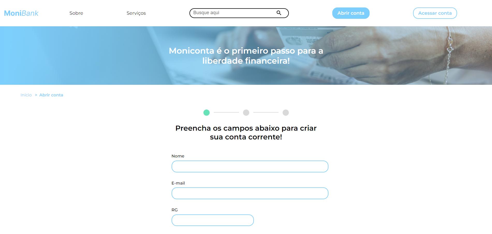

# [MoniBank](https://larisnarciso.github.io/Alura/Front-End/JavaScript/MoniBank/index.html)



Projeto desenvolvido no curso de [JavaScript: validando formulários](https://cursos.alura.com.br/course/javascript-validando-formularios).

Para visualizar o projeto, click no link: [MoniBank](https://larisnarciso.github.io/Alura/Front-End/JavaScript/MoniBank/index.html)

## Descrição

O MoniBank é uma plataforma de banco, onde é simulado uma criação de conta.

- Aplicar atributos de validação de formulário com HTML5
- Validações para os dígitos verificadores do CPF
- Validações de maioridade a partir da comparação de datas
- Mensagens de erro customizadas para cada tipo de campo do formulário
- Captura fotos via webcam

## Instalação:

1. Clone o repositório.

```
https://github.com/larisnarciso/Alura.git
```

2. Dentro da pasta /Front-End/JavaScript/MoniBank abra o arquivo `index.html` no navegador.

## Tecnologias:


