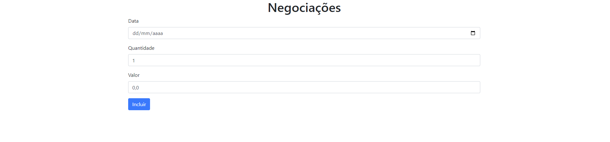

# [Negociacoes](https://larisnarciso.github.io/Alura/Front-End/TypeScript/Negociacoes/dist/index.html)



Projeto desenvolvido nos cursos:

- [TypeScript: Evoluindo seu JavaScript](https://cursos.alura.com.br/course/typescript-evoluindo-javascript)
- [TypeScript: Avançando na linguagem](https://cursos.alura.com.br/course/typescript-avancando-linguagem)
- [TypeScript: Mais técnicas e boas práticas](https://cursos.alura.com.br/course/typescript-tecnicas-boas-praticas)

Para visualizar o projeto, click no link: [Negociacoes](https://larisnarciso.github.io/Alura/Front-End/TypeScript/Negociacoes/dist/index.html)

## Descrição

O Negociacoes é um pequeno projeto de bolsa de valores, que permite cadastrar uma data, quantidade e valor de uma negociação.

- Não pode ser modificada depois de criada.
- Obrigatoriamente tem uma data, quantidade e valor.
- Seu volume é calculado multiplicando-se a quantidade negociada no dia pelo valor negociado.

## Instalação:

1. Clone o repositório.

```
https://github.com/larisnarciso/Alura.git
```

2. Abra a pasta /Front-End/TypeScript/Negociacoes no Visual Studio Code (VSCode).

3. Instale as dependências:

```
cd Alura/Front-End/TypeScript/Negociacoes
npm install
```

4. Inicie o servidor:

```
npm run start
```

## Tecnologias:


